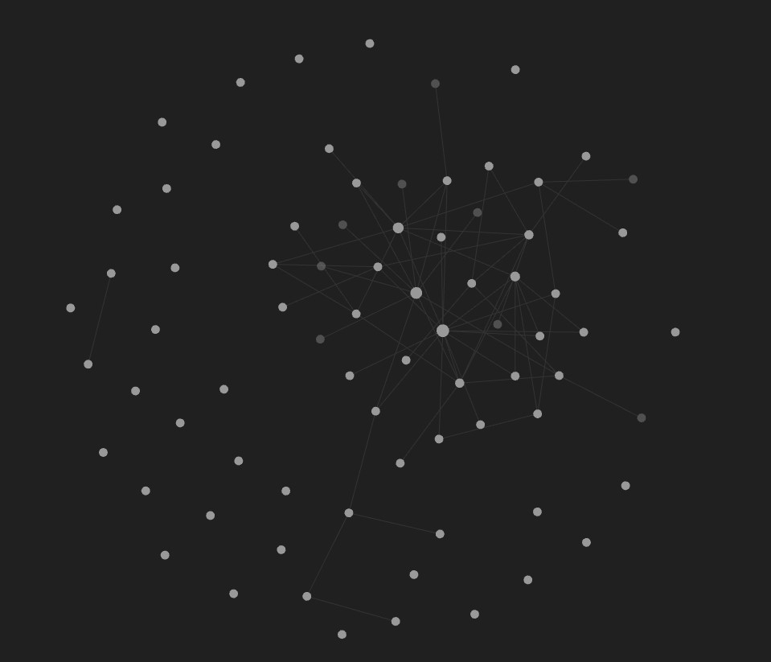

# Second Brain - Rethinking Notes

🔥 Combine knowledge/notes, code, images, any other type of asset. 💯

Notes are written in markdown.

* You can use VS Code and [Foam](https://marketplace.visualstudio.com/items?itemName=foam.foam-vscode)
* You can use a desktop client called [Obsidian](https://obsidian.md/) (Win/Mac/Linux)
* Or you can use both
* Or you can use neither!

But hey, what if we want some inline code? No problem.

```javascript
// Require the framework and instantiate it
const fastify = require('fastify')({ logger: true })

// Declare a route
fastify.get('/', async (request, reply) => {
  return { hello: 'world' }
})
```

And we can also have entire files with code or scripts, for example [dev-setup-example.sh](dev-setup-example.sh)

Our "brain" starts to work like our actual brain (generate a graph with Foam or Obsidian):


Our "brain" is also available everywhere, since we can put it in OneNote and have it sync between machines.

> Tip: Use "Always Keep on this Device" in case you go offline. :-)

## The Thalamus

This brain also has a public component. Anything put into the _Public_ folder will automatically be published to the internet.

This is a work in progress

* Potential tooling: https://github.com/jimbrig/obsidian_published
* Idea how to push latest to git: https://medium.com/analytics-vidhya/how-i-put-my-mind-under-version-control-24caea37b8a5